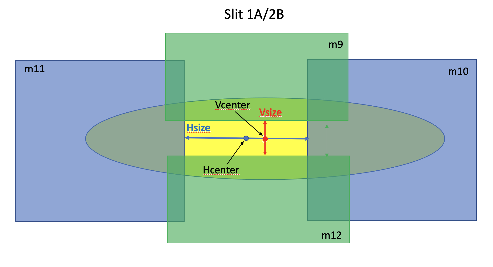

# devices

## arpes_motors.py
done

## beamline_energy.py
- move ID, mono and slit 
- define accessible range of energy vs grating and polarization

## detectors.py
- set detector i.e. redefine tth = 0 (DIAL/USER offset) for the selected detector 
- set gain for SRSs (1 to 4)
- set counting time for the scalers; include all of the following
    - S2: TEY  
    - S3: big diode (d3)
    - S4: small diode (d4)
    - S5: MCP
    - S14: mesh

## diagnostic.py
done

## eps.py
- get main shutter status
- open / close shutters (main, C and D)
- open / close chamber valves (C and D)
- check branch shutter (C or D) status and opens it if closed (depend on mirror position)
- check main shutter status and opens it if closed
- switch branch: move mirror, close/open shutters, turn off camera
- close branch (valve + shutter + MCP HV)
- close all valves
- close all shutters
- turn of all HV power supply

## kappa_motors.py
done

## keithleys.py
- reset settings to default
- convert current to flux
- 

## slits.py

- a set of slits is composed of 4 individuals blades that can be move 2 by 2 (2 vertical blades and 2 horizontal blades) using pseudo/soft motors in order to provide a given slit size (opening between 2 blades that only let a portion of the beam go through) and slit center.

- instead of moving the real motors (4 individual blades) as EpicsMotors, which assumes prefix:m#.VAL for setpoint and prefix:m#.RBV for readback, you will need to create soft motors class and objects for the 4 pseudo motors using the logic we used for th/chi/phi in kappa_motors.py : 

| prefix      |  setpoint PV |  readback PV  |  sync PV  |
|----------   |:------------:|:-------------:|:-------------:|
| 29idb:Slit1H | size.VAL    | t2.C | sync.PROC |
| 29idb:Slit1V | size.VAL    | t2.C | sync.PROC |
| 29idb:Slit1H | center.VAL  | t2.D | sync.PROC |
| 29idb:Slit1V | center.VAL  | t2.D | sync.PROC |

- create plan to move horizontal/vertical center & size to a given value
- the plan needs to first PROC the sync PV to make sure that the pseudo motors are sync with the real motors; the .PROC PV is similar to the .SYNC PV. You will have to copy the logic from the sync_PI_motors() plan (weird complicated wok around Pete cam up with using the abs_set method)
- Use the _status class to print the final size/center of the slits after moving (like we do in _quickmove_plan)
- ingnore the logger for now
- repeat for Slit2B (same syntax for PVs, just replace 1 by 2: 29idb:Slit1H => 29idb:Slit2H)

