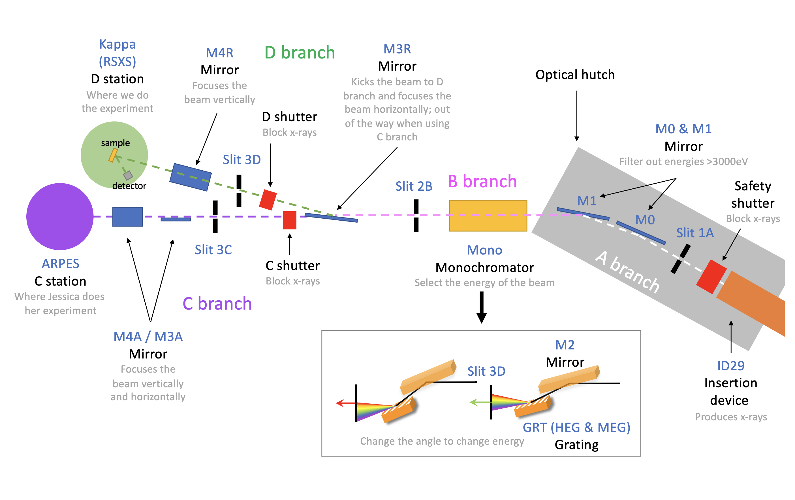
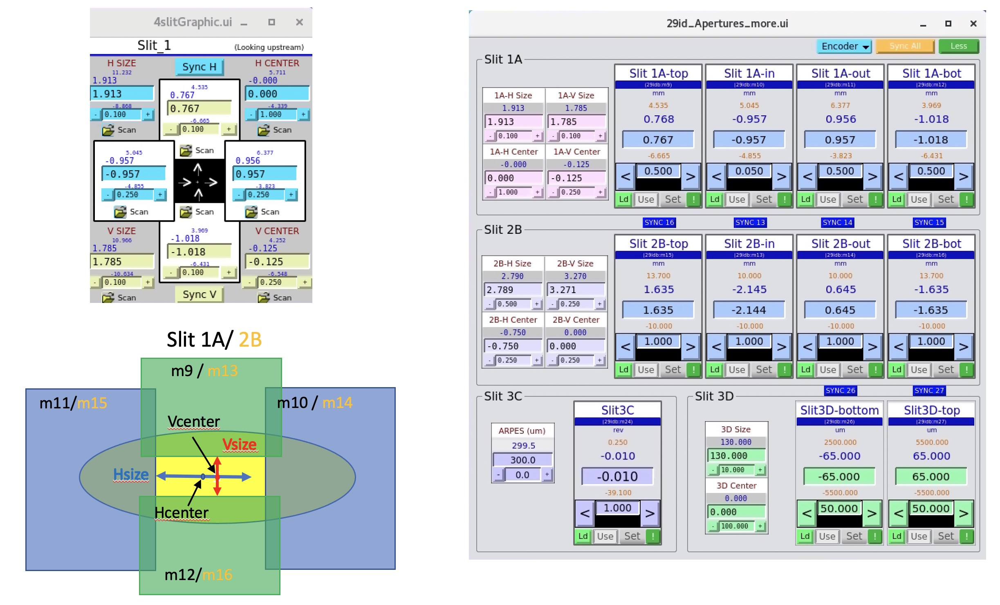

 
 

# ophyd devices

## arpes_motors.py
done

## beamline_energy.py
- move ID, mono and slit 
- define accessible range of energy vs grating and polarization

## detectors.py
- set detector i.e. redefine tth = 0 (DIAL/USER offset) for the selected detector 
- set gain for SRSs (1 to 4)
- set counting time for the scalers; include all of the following
    - S2: TEY  
    - S3: big diode (d3)
    - S4: small diode (d4)
    - S5: MCP
    - S14: mesh

## diagnostic.py
done

## eps.py
- get main shutter status
- open / close shutters (main, C and D)
- open / close chamber valves (C and D)
- check branch shutter (C or D) status and opens it if closed (depend on mirror position)
- check main shutter status and opens it if closed
- switch branch: move mirror, close/open shutters, turn off camera
- close branch (valve + shutter + MCP HV)
- close all valves
- close all shutters
- turn of all HV power supply

## kappa_motors.py
- (fourc) done = Component(EpicsSignalRO,".SOMETHING"): => 29idKappa:Kappa_busy
- done_value = 0 (Done) or 1 (Busy)

        $ fourc_done = EpicsSignalRO("29idKappa:Kappa_busy",name="fourc_done") 

## keithleys.py
- reset settings to default
- convert current to flux

 
 

## slits.py

- a set of slits is composed of 4 individuals blades that can be moved 2 by 2 (2 vertical blades and 2 horizontal blades) using pseudo/soft motors in order to provide a given slit size (opening between 2 blades that only let a portion of the beam go through) and slit center.

- instead of moving the real motors (4 individual blades) as EpicsMotors, which assumes prefix:m#.VAL for setpoint and prefix:m#.RBV for readback, you will need to create soft motors class and objects for the 4 pseudo motors using the logic we used for th/chi/phi in kappa_motors.py : 

| prefix      |  setpoint PV |  readback PV  |  sync PV  |
|----------   |:------------:|:-------------:|:-------------:|
| 29idb:Slit1H | size.VAL    | t2.C | sync.PROC |
| 29idb:Slit1V | size.VAL    | t2.C | sync.PROC |
| 29idb:Slit1H | center.VAL  | t2.D | sync.PROC |
| 29idb:Slit1V | center.VAL  | t2.D | sync.PROC |

- create plan to move horizontal/vertical center & size to a given value (i.e. bluesky equivalent of the old SetSlit1A(Hsize,Vsize,Hcenter,Vcenter) function)
- the very first step of this plan is to trigger the sync PV (here ...sync.PROC) by writing a 1 to it. This makes sure that the pseudo motors are sync with the real motors; the sync.PROC PV works exactly like the .SYNC PV in kappa_motors. You will have to copy the logic from the sync_PI_motors() plan (using the abs_set method)
- Use the _status class to print the final size/center of the slits after moving (like we do in _quickmove_plan)
- ingnore the logger for now
- repeat for Slit2B (same syntax for PVs, just replace 1 by 2: 29idb:Slit1H => 29idb:Slit2H)

 
 

## detectors.py

There are several types of detectors that generate different types of signal: a current (photodiodes), a voltage (mcp), or an image (2D detector).
To read out the detector signal we can use different controllers:
- current amplifier (a fancy multimeter): the model/brand we use is Keithley6485
- pre-amplifier: the model/brand we use is SRS570 (in this case the current coming out of a detector is converted to pulses via voltage to frequency conversion); 
those are read using <b>scalers</b>. 
- area (=2D) detector support: we will work on that last, this is one of the most complicated EPICS object

We need to be able to do 2 things on those devices:
- read the current value of the detector so it can be used in scans: there is an example [here](https://nbviewer.org/github/BCDA-APS/use_bluesky/blob/main/lessons/lesson1.ipynb) in the case of scalers
- adjust the settings of the detector controller: SRS570 has been already defined [here](https://github.com/BCDA-APS/apstools/blob/main/apstools/_devices/srs570_preamplifier.py)

In kelly_test.py, create the following ophyd objects:

- scaler channels 1,2,3,4,5,14:  prefix = 29idMZ0:scaler1 ⇨ see [scaler](https://nbviewer.org/github/BCDA-APS/use_bluesky/blob/main/lessons/lesson1.ipynb) doc 
- pre-amplifier SRS570 29idd:A1 to 4:  prefix = 29idd:A  ⇨   see [SRS570](https://github.com/BCDA-APS/apstools/blob/main/apstools/_devices/srs570_preamplifier.py) class 
- question for Pete: what is the purpose of [PreamplifierBaseDevice](https://github.com/BCDA-APS/apstools/blob/166a5e5bec46adc54f3f6242656ce87b56664c9b/apstools/_devices/preamp_base.py#L24) class?

 

- create a custom ophyd class for <b>Keithley6485</b> by following the SRS570 example;   - prefix = 29idb:ca
  - in this case PV settings use the syntaxes: 
        &nbsp;&nbsp;&nbsp;&nbsp;&nbsp;&nbsp;&nbsp;&nbsp;&nbsp;&nbsp;&nbsp;&nbsp;rate set point: &nbsp; &nbsp;&nbsp;&nbsp;&nbsp;&nbsp;29idb:ca5:rateSet
        &nbsp;&nbsp;&nbsp;&nbsp;&nbsp;&nbsp;&nbsp;&nbsp;&nbsp;&nbsp;&nbsp;&nbsp;rate read back:&nbsp;&nbsp;&nbsp;&nbsp;&nbsp;&nbsp;29idb:ca5:rate

        class Keithley6485(Device):
            rate = Component(EpicsSignal, "rate", write_pv="rateSet")
            ...
 - create keithley objects 29idb:ca1 to 15

 

 
 
 REMEMBER: the <b>ophyd</b> part concists in creting the object using the appropriated ophyd classes to connect to the hardware; the <b>bluesky</b> part are the "plans". At some point we will separate those (ophyd object will be defined in "devices", plans in "scans")