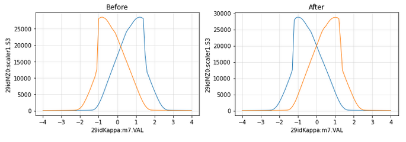

# Kappa Alignment

## Align M3R to center of rotation:
1) start from the last known value for M3R
2) align direct beam on d4 and reset tth0::

        align_d4(z0,th)
        mvtth(new_value)
        tth0_set()
   
    note: &nbsp;- th can be 0 or 180 (no need to care about omega here) 
    &emsp;&emsp;&ensp; - at that point z0 is a rough estimate 
    &emsp;&emsp;&ensp; - **use d3 only to measure z** (d4 is too narros)

3) align z at th=0::

        z0=align_z0(0)

4) find omega0 at th/2th=15,30::

        omega0=align_th0(0,z0)

5) iterate until it converges, keeping an eye on the mirror position (1pxl ~ 50um on z)

6) go to th=180 and repeat steps 3 to 5 to find z180 and omega180

7) find mirror position to reach target z value:
       
         z_opt=(z0+z180)/2

8) **realign tth0** for new mirror position (step 2)

9) refine omega180/z180 and omega0/z0 for new tth0, keeping a close eye on the mirror to make sure it stays at the optimal position

---------------------------------------

## Determine kth_offset:

If th_0 and th_180 is the motor position at specular near th=15 and th=165, respectivaley (eg th_0=13.671 and th_180=163.65):

        Offset = 0.5*(180 - th_180 - th_0)

With motor at 0, the actual value is Offset.

---------------------------------------

##  Align M4R to center of rotation:
1) move to th=90, chi=0, phi=90

2) find z:

        align_z0_chi0()

3) adjust M4R pitch (v) to match z0=z180

4) check if moving M4R did not change the in/out alignmnent (M3R optimal pixel)

---------------------------------------

##  Determined kap offset:

1) compare kap scans at (th,chi,phi) = (90,0,90) and (270,0,-90):

        dscankap(-4,4,0.1)

2) set the value of intersection (here 0.18) to 0:

