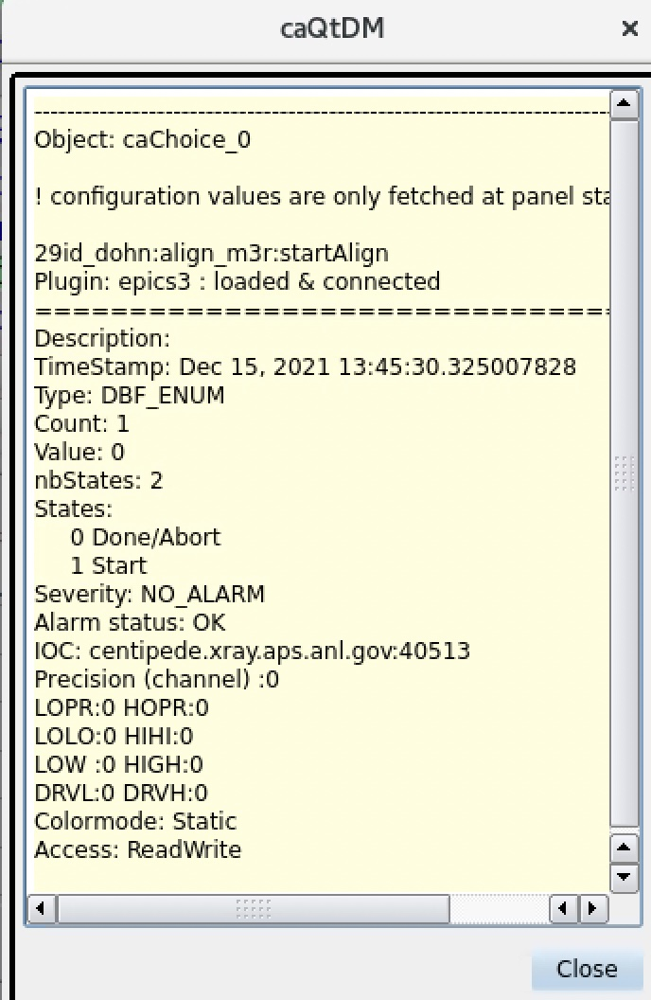

# General questions:
- <b>Answered:</b> how to set-up data broker? do I need to "change" it between users? No.
- <b>Answered:</b> how do I create a new catalog for a new experiment/users? we keep the same catalog; we change the metadata RE.md (see setup new user below)
- <b>Answered:</b> how do I reset the scan id number? 

        RE.md["scan_id"]      # returns the last scan_id
        RE.md["scan_id"] = 0  # set the next scan_id to 1
        RE.md["scan_id"] = 202112080000

- <b>Answered:</b> how to setup new user experiment: eg [USAXS setup_new_user.py](https://github.com/APS-USAXS/ipython-usaxs/blob/master/profile_bluesky/startup/instrument/utils/setup_new_user.py) 
- how do I set my profile for Jupyter like I do for ipython ?(my alias pointing to profile-bluesky gets over-written by my profile-default)
- how to delete a kernel?
- <b>Answered (partially):</b> BestEffortsCallback: 
    - can I turn off the visualisation of the baseline and/or limit it to a subset of pvs?
    - can I customize the plot visualisation to display only a subset of scaler (not all)? add grey scale? see [BestEffortsCallback doc](https://github.com/bluesky/bluesky/blob/1f277a044e5b23ae5f98c86d77c3871b4c9a1dc5/bluesky/callbacks/best_effort.py#L72-L78)
- how does the logger work?
- <b>Answered:</b> how to extract data for user? 
    - Overview: [here](https://github.com/BCDA-APS/bluesky_training/blob/main/export-bluesky-data.md)
    - Export to CSV: [here](https://nbviewer.org/github/BCDA-APS/bluesky_training/blob/main/export-to-csv.ipynb)
- <b>Answered:</b> can I call slit1_set in slitbl_set? Yes
- <b>To do:</b> scan time estimate and progress bar? => NIKEA (general or bluesky) 

# Questions for Pete:

- troubleshot soft motors (4C) done value?
- how to implement the busy/done for align_m3r pv *29id_dohn:align_m3r:startAlign*

- how can I make an ERF fit (derivative?) 
- how can I fit as part of a plan ? eg align_tth_plan = scan tth, find peak, return peak, playsound 
    see [Max's plan](https://github.com/APS-29ID-IEX/alignSample)
- how do I add the m3r centroid (EpicsSignal, not scaler) to my detectors? 
- how to implement a detector/positioner settling time?
- what's wrong with ps.reset()?

# TODO:
- check out apstools.plans.TuneAxis
- make calcID a method of the ID?
- separate plans from devices
- create a custom_name.py in devices package (x_motor = kappa_motors.m2, srs4=srs.A4 ect...)
- how to load my instrument? 
    - instrument import: instrument package where _ _init_ _.py import all devices in defined order
    - copy PJ module structure and adapt exp setup to 29id
- rename scaler channels (d3, d4, mcp, tey - no caps); rename select_detector detector_select
- check code for energy calibration and slits (make sure there is no bad mix of ophyd and plans)
- rename slits.py/slits object
- move read dictionary to utils.misc (currently in both bp_slits and bp_energy)
- troubleshot utils.plot (mono not defined?)
- test LivePlot
- look at 4ID-D slits: https://github.com/APS-4ID-POLAR/ipython-polar/tree/master/profile_bluesky/startup/instrument/devices
    - what do I gain from it?
    - what is a Formatted component
    - sd.beamline.append(wbslit)
- Add apsbss screen: see [documentation](https://bcda-aps.github.io/apsbss/apsbss.html#displays-for-medm-caqtdm) (ctrl+f "display screen")
  
  

 # Notes from 2021-3 run:
- caput/caget:
    - caput = somepv.put()
    - caget = somepv.get()
    - <b>DO NOT USE somepv.<u>value</u></b>
- __move__ is for positioners; __put__ is for epics signals
- test plan: _summarize_plan_ in bluesky.simulator
- different streams:
    - primary stream: what gets triggered at every point
    - baseline: before and after snapshot
    - monitors: saved at the device own rate
- md={'comment':'demo'}: dictionnary of metadata

            def my_plan(detlist, count_time=1, md=None):
                if md is None: md={}
                yield from bp.count(det,md=md)
    - all standart plan have md=None arg
    - needs to be built in for custom plans like above
    - run = cat[-1]: run.metadata["start"] and run.metadata["stop"] (stop contains success message) 
- to print in a plan:

        print('tth0 is defined as direct beam on d4 only')
        yield from bps.null()
- staging = dictionary:
    - use m1.stage.sigs to see dictionary
    - m1.component_names to see keys
    - called by bp, not bps 
- BestEffortsCallback: eg: bec.disable_table(), see [documentation](https://github.com/bluesky/bluesky/blob/1f277a044e5b23ae5f98c86d77c3871b4c9a1dc5/bluesky/callbacks/best_effort.py#L72-L78)
- Extract dataset: 

        ds["noisy"].to_numpy()
        'to_cdms2',
        'to_dataframe',
        'to_dataset',
        'to_dict',
        'to_index',
        'to_iris',
        'to_masked_array',
        'to_netcdf',
        'to_numpy',
        'to_pandas',
        'to_series',
        'to_unstacked_dataset'

# Notes from 2022-1 run:
- How to set up the _instrument_ package (see [example](https://github.com/BCDA-APS/bluesky_training/tree/main/bluesky/instrument8)):
    - intrument / callback:
        - gets stuff output by the run engin
        - eg: generating a file, custom plots
    - instrument / devices:
        - describe hardware in ophyd
        - can contain plans in SOME cases, or python functions or method necessary to obtain a given device behavior (usually that only concern THAT one device)
    - instrument / \__init__.py:
        - defines what needs to be imported (and the order of importation)
        - uses leading dots (relative imports)
        - uses \__all__ = ["a_class","an_object","a_function"] to import only what is needed
    - instrument / framework: set up bluesky
        - databroker
        - catalog (name is defined by BCDA)
        - run engine

- storage ring info::

        aps = apstools.devices.ApsMachineParametersDevice(name="aps")
- beamline scheduling info::

        pip install --no-deps apsbss

    in python: 

        from apsbss import apsbss
        apsbss.listESAFs("2022-1",29)   # listESAFs needs sector number
        Pass.listProposals("2022-1","29-ID-C,D')  # listProposals needs BL name as defined by the system
    to print a readable dictionary:

        import pprint 
        pprint.pprint(apsbss.listESAFs("2022-1",29))

        # or:

        from pprint import pprint
        pprint(apsbss.listESAFs("2022-1",29))
    
# How to deal with busy records:

- Example with align_m3r:

        In [2]: align_m3r=EpicsSignal('29id_dohn:align_m3r:startAlign',name='align_m3r',put_complete=True)

        In [3]: align_m3r.enum_strs
        Out[3]: ('Done/Abort', 'Start')

        In [4]: !cainfo 29id_dohn:align_m3r:startAlign
        29id_dohn:align_m3r:startAlign
            State:            connected
            Host:             164.54.118.100:39338
            Access:           read, write
            Native data type: DBF_ENUM
            Request type:     DBR_ENUM
            Element count:    1

        In [5]: align_m3r.get()
        Out[5]: 0

        In [7]: align_m3r.get(as_string=True)
        Out[7]: 'Done/Abort'

        In [8]: align_m3r.pvname
        Out[8]: '29id_dohn:align_m3r:startAlign'

        In [9]: ! caget 29id_dohn:align_m3r:startAlign
        29id_dohn:align_m3r:startAlign Done/Abort

        In [10]: ! caget -n 29id_dohn:align_m3r:startAlign
        29id_dohn:align_m3r:startAlign 0

        In [11]: ! caget 29id_dohn:align_m3r:startAlign.RTYP
        29id_dohn:align_m3r:startAlign.RTYP busy

- If __RTYP = busy__ :  means it is a busy record, which always has the following PVs, where __ZNAM = done__ and __ONAM = busy__:

        In [12]: ! caget 29id_dohn:align_m3r:startAlign.ZNAM
        29id_dohn:align_m3r:startAlign.ZNAM Done/Abort

        In [13]: ! caget 29id_dohn:align_m3r:startAlign.ONAM
        29id_dohn:align_m3r:startAlign.ONAM Start

# Example of aps output:
- Return storage ring info:

        In [14]: import apstools.devices

        In [15]: aps = apstools.devices.ApsMachineParametersDevice(name="aps")

        In [16]: aps.current.get()
        Out[16]: -0.00774811931800002

        In [17]: aps.summary()
        data keys (* hints)
        -------------------
        aps_aps_cycle
        aps_current
        aps_fill_number
        aps_global_feedback
        aps_global_feedback_h
        aps_global_feedback_v
        aps_lifetime
        aps_machine_status
        aps_operating_mode
        aps_operator_messages_fill_pattern
        aps_operator_messages_floor_coordinator
        aps_operator_messages_last_problem_message
        aps_operator_messages_last_trip_message
        aps_operator_messages_message6
        aps_operator_messages_message7
        aps_operator_messages_message8
        aps_operator_messages_operators
        aps_orbit_correction
        aps_shutter_permit

        read attrs
        ----------
        current              EpicsSignalRO       ('aps_current')
        lifetime             EpicsSignalRO       ('aps_lifetime')
        aps_cycle            ApsCycleDM          ('aps_aps_cycle')
        machine_status       EpicsSignalRO       ('aps_machine_status')
        operating_mode       EpicsSignalRO       ('aps_operating_mode')
        shutter_permit       EpicsSignalRO       ('aps_shutter_permit')
        fill_number          EpicsSignalRO       ('aps_fill_number')
        orbit_correction     EpicsSignalRO       ('aps_orbit_correction')
        global_feedback      EpicsSignalRO       ('aps_global_feedback')
        global_feedback_h    EpicsSignalRO       ('aps_global_feedback_h')
        global_feedback_v    EpicsSignalRO       ('aps_global_feedback_v')
        operator_messages    ApsOperatorMessagesDevice('aps_operator_messages')
        operator_messages.operators EpicsSignalRO       ('aps_operator_messages_operators')
        operator_messages.floor_coordinator EpicsSignalRO       ('aps_operator_messages_floor_coordinator')
        operator_messages.fill_pattern EpicsSignalRO       ('aps_operator_messages_fill_pattern')
        operator_messages.last_problem_message EpicsSignalRO       ('aps_operator_messages_last_problem_message')
        operator_messages.last_trip_message EpicsSignalRO       ('aps_operator_messages_last_trip_message')
        operator_messages.message6 EpicsSignalRO       ('aps_operator_messages_message6')
        operator_messages.message7 EpicsSignalRO       ('aps_operator_messages_message7')
        operator_messages.message8 EpicsSignalRO       ('aps_operator_messages_message8')

        config keys
        -----------

        configuration attrs
        -------------------
        operator_messages    ApsOperatorMessagesDevice('aps_operator_messages')

        unused attrs
        ------------

# Example of apsbss output:
- To check actual spelling for a given beamline::

        (base) [bashful ~] apsbss beamlines
        1-BM-B,C       8-ID-I         15-ID-B,C,D    23-BM-B        
        1-ID-B,C,E     9-BM-B,C       16-BM-B        23-ID-B        
        2-BM-A,B       9-ID-B,C       16-BM-D        23-ID-D        
        2-ID-D         10-BM-A,B      16-ID-B        24-ID-C        
        2-ID-E         10-ID-B        16-ID-D        24-ID-E        
        3-ID-B,C,D     11-BM-B        17-BM-B        26-ID-C        
        4-ID-C         11-ID-B        17-ID-B        27-ID-B        
        4-ID-D         11-ID-C        18-ID-D        29-ID-C,D
        ...
        
- Help:

        (base) [bashful ~] apsbss --help
        usage: apsbss [-h] [-v] {beamlines,current,cycles,esaf,list,proposal,clear,setup,update,report} ...

        Retrieve specific records from the APS Proposal and ESAF databases.

        optional arguments:
        -h, --help            show this help message and exit
        -v, --version         print version number and exit

        subcommand:
        {beamlines,current,cycles,esaf,list,proposal,clear,setup,update,report}
            beamlines           print list of beamlines
            current             print current ESAF(s) and proposal(s), DEPRECATED: use 'list' instead
            cycles              print APS run cycle names
            esaf                print specific ESAF
            list                list by cycle
            proposal            print specific proposal
            clear               EPICS PVs: clear
            setup               EPICS PVs: setup
            update              EPICS PVs: update from BSS
            report              EPICS PVs: report what is in the PVs
   
- Get the list of proposals for _29-ID-C,D_: 
 Note that proposal __with an ESAF__ are listed separatly with ID = experiment## vs ID = proposal## for beamtime __without ESAF__
    
            (base) [bashful ~] apsbss list 29-ID-C,D
            Proposal(s):  beam line 29-ID-C,D,  cycle(s) now

            ===== ====== ========================= ========================= ==================== ========================================
            id    cycle  start                     end                       user(s)              title                                   
            ===== ====== ========================= ========================= ==================== ========================================
            77679 2022-1 2022-04-25 08:00:00-05:00 2022-04-27 08:00:00-05:00 Cabana-Jimenez,Roy   Analysis of M LII,III-edge XAS intens...
            75822 2022-1 2022-04-20 08:00:00-05:00 2022-04-24 08:00:00-05:00 Middey,Patel,Free... Investigation of the electronic and m...
            76012 2022-1 2022-04-12 08:00:00-05:00 2022-04-18 08:00:00-05:00 Meyers,Lamichhane... Establishing the importance of interl...
            77790 2022-1 2022-04-05 08:00:00-05:00 2022-04-11 08:00:00-05:00 Li,McChesney,Zhou... Photoemission studies of oxide-graphe...
            76031 2022-1 2022-03-29 08:00:00-05:00 2022-03-31 08:00:00-05:00 Li                   X-ray Absorption Spectroscopy Study o...
            77626 2022-1 2022-03-22 08:00:00-05:00 2022-03-28 08:00:00-05:00 Cochran,Belopolsk... Measurment of magnetic topological in...
            77755 2022-1 2022-03-16 08:00:00-05:00 2022-03-21 08:00:00-05:00 Hong,Liu,Chiang,Fang Probing the intertwined helical spin ...
            69925 2022-1 2022-03-10 08:00:00-06:00 2022-03-12 08:00:00-06:00 Liu,Li,Bi            Exploring cationic and anionic redox ...
            77393 2022-1 2022-03-03 08:00:00-06:00 2022-03-10 08:00:00-06:00 Checkelsky,Zheng,... ARPES of Single-crystalline Graphite ...
            75646 2022-1 2022-02-22 08:00:00-06:00 2022-02-28 08:00:00-06:00 Frano Pereira,Das... Finding magnetic moment orientations ...
            75503 2022-1 2022-02-15 08:00:00-06:00 2022-02-17 08:00:00-06:00 DeRoo,Tammes,Kaar... CMOS sensors as soft x-ray detectors    
            56426 2022-1 2022-02-08 08:00:00-06:00 2022-04-20 08:00:00-05:00 McChesney,Rodolak... Characterizing and optimizing the per...
            ===== ====== ========================= ========================= ==================== ========================================

            ESAF(s):  sector 29,  cycle(s) now

            ====== ======== ========== ========== ==================== ========================================
            id     status   start      end        user(s)              title                                   
            ====== ======== ========== ========== ==================== ========================================
            251138 Approved 2022-02-14 2022-02-18 Kaaret,Fuller,Pac... CMOS sensors as soft x-ray detectors    
            250954 Approved 2022-02-01 2022-04-28 McChesney,Freelan... Characterizing and optimizing the per...
            ====== ======== ========== ========== ==================== ========================================

- Get the ESAF info for a given beamtime: 
 Note that proposal __with an ESAF__ are listed separatly with ID = experiment## vs ID = proposal## for beamtime __without ESAF__

            (base) [bashful ~] apsbss esaf 251138  # needs ESAF_ID
            description: We will test a CMOS sensor for soft X-ray detection. The CMOS sensor...
            esafId: 251138
            esafStatus: Approved
            esafTitle: CMOS sensors as soft x-ray detectors
            experimentEndDate: '2022-02-18 08:00:00'
            experimentStartDate: '2022-02-14 08:00:00'
            experimentUsers:
            - badge: '304905'
            badgeNumber: '304905'
            email: philip-kaaret@uiowa.edu
            firstName: Philip
            lastName: Kaaret
            ...

- Get the proposal info for a given beamtime: 
 Note that proposal __with an ESAF__ are listed separatly with ID = experiment## vs ID = proposal## for beamtime __without ESAF__

            (base) [bashful ~] apsbss proposal 75822 2022-1 29-ID-C,D
            activities:
            - duration: 345600
            endTime: '2022-04-24 08:00:00-05:00'
            startTime: '2022-04-20 08:00:00-05:00'
            duration: 345600
            endTime: '2022-04-24 08:00:00-05:00'
            experimenters:
            - badge: '227540'
            email: smiddey@iisc.ac.in
            firstName: Srimanta
            id: 499096
            instId: 4383
            institution: Indian Institute of Science
            lastName: Middey
            piFlag: Y
            ...
            mailInFlag: N
            proprietaryFlag: N
            startTime: '2022-04-20 08:00:00-05:00'
            submittedDate: '2021-07-02 05:22:58-05:00'
            title: Investigation of the electronic and magnetic structures of NdNiO3/NdMnO3 superlattices
            totalShiftsRequested: 24